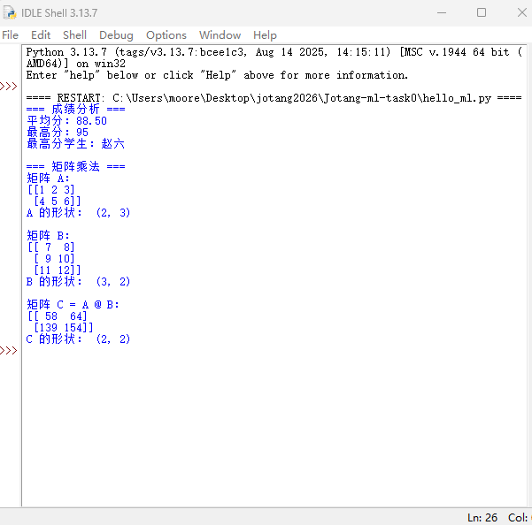

# 机器学习入门学习笔记
## 入门笔记
### 人工智能、机器学习与深度学习的关系
人工智能（AI）：最大范畴，目标是让机器表现出智能行为，包括推理、规划、感知、决策、语言理解等。

机器学习（ML）：AI 的一个子领域，核心是让机器从数据中自动学习规律，而不是人工写死规则。

深度学习（DL）：机器学习的一个子领域，主要使用多层神经网络自动学习数据的层次化特征。

关系可理解为：
> 人工智能 ⊃ 机器学习 ⊃ 深度学习

### 监督学习和无监督学习
||有无标签|目标|例子|
|-|------|----|---|
|监督学习|有|学习输入到输出的映射|垃圾邮件分类|
|无监督学习|无|发现数据内部结构|客户分群|

### 数据、特征、标签；训练集、验证集、测试集
数据、特征、标签
* 数据：样本的集合。
* 特征：描述样本的属性，是模型输入，如年龄、收入、像素值、词向量。
* 标签：监督学习中希望模型预测的目标，如类别、房价、点击率。

训练集、验证集、测试集
* 训练集：用于训练模型参数，如权重和偏置。
* 验证集：用于调超参数、选择模型、早停，不直接更新参数。
* 测试集：只在最后评估模型泛化能力，不能用于训练或调参。

### batch size
batch size 是一次前向传播和反向传播中使用的样本数量。

影响：

小 batch：内存占用小，梯度噪声大，可能有一定正则化效果，但训练不稳定，速度可能慢。

大 batch：梯度更稳定，硬件利用率高，但内存需求大，可能泛化稍差，常需调整学习率。

batch size 还影响一个 epoch 的迭代次数

### 模型和模型参数？
模型：从输入到输出的映射函数

模型参数：模型内部可学习的变量

### 神经网络由哪些基本部分组成？激活函数是什么？为什么需要？常见激活函数
神经网络基本部分：

* 输入层、隐藏层、输出层
* 神经元/全连接层
* 权重和偏置
* 激活函数
* 损失函数
* 优化器

激活函数：对线性输出做非线性变换的函数。

为什么需要激活函数？

如果没有激活函数，多层线性变换叠加仍然是线性变换：

网络无法拟合复杂非线性关系。激活函数引入非线性，使神经网络具有强大表达能力。

常见激活函数：

* Sigmoid：$σ(x)=\frac{1}{1+e^{-x}}$
* Tanh
* ReLU：$\max(0,x)$
* Leaky ReLU：$\max(αx,x)$
* ELU / GELU / Swish：更平滑或表现更好的变体。
* Softmax：常用于多分类输出层，把输出变成概率分布。
* Softplus:$\ln(1+e^{x})$

### 矩阵如何求导

暂时还没搞懂

## 前向传播与反向传播；损失函数、梯度、学习率

前向传播：输入数据经过各层计算，得到预测输出和损失。

反向传播：从损失出发，利用链式法则计算每个参数的梯度。

损失函数：衡量预测值与真实标签的差距，如交叉熵、均方误差。

梯度：损失对参数的偏导，表示参数往哪个方向调整能使损失下降最快。

学习率：控制参数更新步长。

### 优化器
优化器是根据梯度更新模型参数的算法。

常见优化器：

* SGD：随机梯度下降，简单但可能收敛慢。
* Momentum：引入动量，加速并减少震荡。
* NAG：Nesterov 加速梯度。
* AdaGrad：自适应学习率，适合稀疏特征。
* RMSProp：用梯度平方的滑动平均调整学习率。
* Adam：结合动量和 RMSProp，常用且稳定。
* AdamW：Adam 加解耦权重衰减，Transformer 中常用。
* Nadam、Adadelta、LBFGS 等。

### 过拟合、欠拟合、正则化
欠拟合：模型太简单或训练不足，训练集和测试集表现都差。

过拟合：模型太复杂或数据太少，训练集表现很好，测试集表现差。

正则化：约束模型复杂度，提升泛化能力。

## 热身

## 开发环境
### 为什么不同项目最好使用不同的 Python 虚拟环境？
Python项目往往依赖大量第三方包，可能需要不同的Python版本。使用不同的 Python 虚拟环境可以防止版本冲突、依赖污染、权限管理、无法复现、协作困难等问题。

### CPU 和 GPU
CPU擅长：串行逻辑、复杂控制流；分支判断、低延迟任务、操作系统、数据库、编译器、数据预处理、小规模计算和调试

GPU擅长：高度并行的重复计算、矩阵乘法、卷积、向量运算、大规模数值计算、高吞吐量任务、图形渲染、深度学习训练

###  CUDA 是什么？它、显卡驱动与 PyTorch 之间是什么关系？
CUDA 是 NVIDIA 推出的并行计算平台和编程模型，让开发者可以用 NVIDIA GPU 做通用计算，不只是图形渲染。

显卡驱动、CUDA 与 PyTorch 是“硬件→驱动→计算层→框架”的自下而上依赖链：驱动让系统识别显卡，CUDA 提供 GPU 计算能力，PyTorch 通过调用 CUDA 实现 GPU 加速。